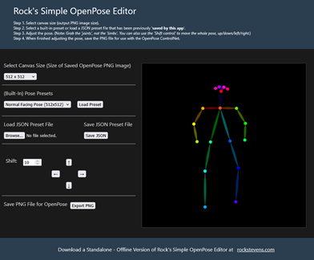

# Rock's Simple OpenPose Editor

Rock's Simple OpenPose Editor is a lightweight, web-based (offline) tool designed to create and edit OpenPose-style human poses. The editor allows you to generate body pose keypoints and save them as PNG image files for use in AI image generation, particularly with Stable Diffusion’s ControlNet.

Here's a Screenshot of the editor. 

 
  

### Summary of Features

| Feature | Description |
| --- | --- |
| **Pose Editing** | Drag and adjust joints directly. |
| **Presets** | Load built-in or custom user saved poses. |
| **Export Options** | PNG for images, JSON for pose data. |
| **Import Options** | JSON for pose data. |
| **Shift Controls** | Move the entire pose easily. |
| **OpenPose-Compatible** | Works with SD ControlNet, OpenPose. |
| **Lightweight and Easy to Use** | Browser-based, No internet needed to use. |
| **No Coding Skills Required** | Just Basic Mouse Control. |

  
----  

### Typical Uses

| Use | Ideas |
| --- | --- |
| **Concept Art** | Game concept art with specific poses. |
| **Visual storytelling** | Comics, Panels, Scenes, Backgrounds and more... |
| **Pose Estimation** | Just simply trying to get the person to stand how you want them,   rather than 100 images later, finally standing the way you want. :)   Make that actaully happen a lot faster using OpenPose ! |

----  

### Step-by-Step: Create a Pose for OpenPose ControlNet

| Step | Action |
| --- | --- |
| **1\. Open the Editor** | [Launch](rkopenpose.html) Rock’s Simple OpenPose Editor. |
| **2\. Set Canvas Size** | Choose a canvas size like \`512 x 512\`.   The selected size should match the size you plan to use as your output image in Stable Diffusion. |
| **3\. Load a Starting Pose (Optional)** | Select a built-in pose from the dropdown (e.g., \`Normal Facing Pose\`, will load on start up).   Click 'Load Preset' to load it into the canvas. |
| **4\. Edit the Pose** | Drag the colored 'joints (dots)' to change the pose.   The 'limbs (lines)' will follow automatically.   Use the 'Shift Control Arrow Buttons' to move the entire pose on the canvas if needed. |
| **5\. Export the Pose as PNG** | Click 'Export PNG'.   This saves a pose map (black background with colored stick figure).   This is your 'OpenPose Image Input' for SD ControlNet. |
| **6\. Save the Pose as JSON (Optional)** | Once finished designing your pose. You can then save it to a JSON type formatted file by clicking on the 'Save JSON' button, which you can load again later with the 'Browse' button. You can then modify and save as another pose. Create and save as many as you want. |
  
----  

### Step-by-Step: Create a Pose for OpenPose ControlNet

| Step | Action |
| --- | --- |
| **1\. In your Stable Diffusion   Image Generation Software** | Select the 'OpenPose ControlNet' model. |
| **2\. Setup your Input Image for OpenPose** | Upload the exported 'PNG file'. |
| **3\. Generate an Image** | Write a 'text prompt' (e.g., 'a person dancing in the street'). |
| **4\. After Image Generation** | Observe results from using OpenPose ControlNet. |
  
----  

### Follow these Tips for Best Results

*   Avoid unrealistic joint angles — make poses natural.
*   Keep the pose proportional to human anatomy.
*   Center the pose model on the canvas, as 'where in the generated image' it should appear.
*   Think of proportions when sizing the pose model, to be proportional to the size of other objects in the generated image.
*   Use clear, descriptive prompts for the best alignment between pose and appearance.
  
----  

## Try out Rock's Simple OpenPose Editor

Click on this link [Rock's Simple OpenPose Editor](rkopenpose.html)  
Note: Opens in new window. But then, you can save it and use it offline :)

----  

### References

*   [OpenPose GitHub](https://github.com/CMU-Perceptual-Computing-Lab/openpose)
*   [Stable Diffusion by CompVis](https://github.com/CompVis/stable-diffusion)
*   [ControlNet Paper (arXiv)](https://arxiv.org/abs/2302.05543)
*   [SD ControlNet GitHub (lllyasviel)](https://github.com/lllyasviel/ControlNet)
*   [SD ControlNet OpenPose (Huggingface - lllyasviel)](https://huggingface.co/lllyasviel/sd-controlnet-openpose)
  
----  

### License and Usage Notes

Rock's Simple OpenPose Editor is free to use (no login required). 

The outputs this editor creates can be used freely in personal or commercial art generated with Stable Diffusion. 

You also have exclusive rights to the outputs from this editor.
  
----  

### Downloads

Offline version available for privacy-focused workflows.  
  
Just download the HTML file from this link ([Rock's Simple OpenPose Editor](rkopenpose.html)) and save to your computer.  
Then just open in your web browser, 0% internet needed, 100% offline.  

----

MIT License
Copyright (C) 2025-present [Rock Stevens](https://rockstevens.com)
